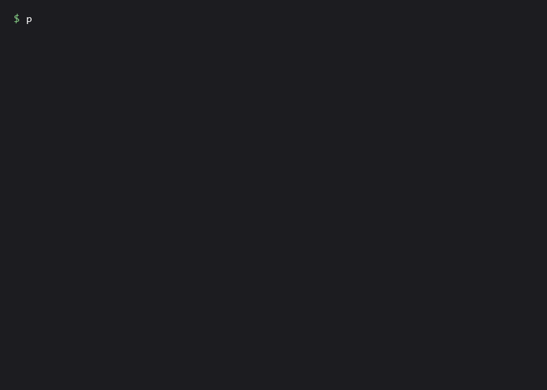

# agentcam

[](https://github.com/shihchengwei-lab/agentcam/actions/workflows/ci.yml)
[](https://pypi.org/project/agentcam/)

> Local-first CLI wrapper that records what your AI coding agent changed in your repo and generates a Markdown run report after each run.

<p align="center">
  
</p>

agentcam does **not** replace Claude Code, Codex, OpenHands, Aider, or any
other coding agent. It wraps them.

```bash
agentcam run -- claude "fix the failing tests"
agentcam run -- codex "add input validation to login form"
agentcam run -- bash -lc "npm run build && npm test"
```

After each run, you get an `AGENT_RUN_REPORT.md` answering three questions:

1. **What did the agent change?** — exact file list, diff stat, staged vs.
   unstaged vs. untracked, before/after HEAD.
2. **Where should I look first?** — heuristic risk flags for auth paths,
   secrets, deletions, dangerous shell strings (`rm -rf /`, `git reset
   --hard`, conflict markers), dependency manifests.
3. **How do I roll back if something's wrong?** — situation-aware rollback
   notes (no blanket `git reset --hard` suggestions).

See [`examples/risky-auth-change/expected-report.md`](examples/risky-auth-change/expected-report.md)
for what a report looks like when the agent touches a sensitive area.

---

## What this is NOT

This is a **flight recorder**, not a governance platform.

- Not a sandbox.
- Not a pre-execution gate. agentcam does not block dangerous commands; it
  records that they happened and flags them for review *after*.
- Not a security scanner. The risk flags are heuristics ("look here"), not
  verdicts ("this is bad").
- Not an audit / compliance tool. The Markdown report is for the developer
  reviewing the diff, not for a SOC2 evidence pipeline.
- Not a SaaS. There is no account, no upload, no telemetry. Everything
  stays under `.git/agentcam/runs/` on your machine.

---

## Install

agentcam needs Python ≥ 3.11 and `git`.

```bash
pipx install agentcam
```

Or via `pip` into a venv:

```bash
pip install agentcam
```

Available on PyPI: <https://pypi.org/project/agentcam/>.

Verify:

```bash
agentcam version
# agentcam 0.1.0
```

---

## Quick start

Inside any git repository:

```bash
agentcam run -- bash -lc "echo hello > demo.txt"
```

agentcam will:

1. snapshot git state (HEAD, branch, staged / unstaged / untracked)
2. run your command, tee-ing stdout and stderr to logs (raw + redacted)
3. snapshot git state again
4. scan for risk flags (path patterns, output patterns, deletions)
5. write `AGENT_RUN_REPORT.md` and `manifest.json` under
   `.git/agentcam/runs/<run_id>/`
6. exit with 0 if your command succeeded, 1 otherwise

stdout and stderr stream live to your terminal — agentcam does not buffer
them.

If the wrapped command produced **no git-visible changes** and exited
successfully, the run directory is auto-deleted and stderr gets a
`no git-visible changes; report skipped` notice. Pass `--keep-empty`
before `--` to opt out and always keep the report:

```bash
agentcam run --keep-empty -- claude -p "..."
```

This is the "no-diff cleanup" default. The same logic applies to Hook
mode (see below). Full rationale: [`docs/design.md` § 23](docs/design.md).

### Wrapping Claude Code

```bash
agentcam run --name claude-fix-tests -- claude "fix the failing tests"
```

### Wrapping Codex

```bash
agentcam run --name codex-add-validation -- codex "add input validation to login form"
```

### Wrapping anything (with shell features)

agentcam runs the command with `shell=False`. If you need pipes, redirects,
variable expansion, wrap your own shell explicitly:

```bash
agentcam run -- bash -lc "npm run build 2>&1 | tee build.log"
agentcam run -- pwsh -Command "Get-Process | Out-File procs.txt"
agentcam run -- cmd /c "dir > files.txt"
```

This is a deliberate constraint — see [`docs/design.md` § 4](docs/design.md).

---

## Hook mode (Claude Code: no wrapper needed)

If your agent is Claude Code, you can register agentcam as a hook so
that every `claude` session is recorded automatically — no need to
remember a wrapper command. Add this to `~/.claude/settings.json` (or
a per-project `.claude/settings.json`):

```json
{
  "hooks": {
    "SessionStart": [{"matcher": "", "hooks": [
      {"type": "command", "command": "agentcam hook-session-start"}
    ]}],
    "SessionEnd": [{"matcher": "", "hooks": [
      {"type": "command", "command": "agentcam hook-session-end"}
    ]}]
  }
}
```

That's the whole setup. Start a `claude` session in any git repo, make
some changes, exit. agentcam writes the report under
`.git/agentcam/runs/<run_id>/` automatically. Sessions that don't touch
the working tree leave no trace — the no-diff cleanup applies the
same way as in the wrapping path.

Hook mode is Claude Code-specific (it uses Claude Code's settings.json
hook mechanism). For other agents (Codex, Aider, OpenHands), use the
generic wrapping path above (`agentcam run -- ...`).

Both hook commands always exit 0; Claude Code is never blocked even
if agentcam has an internal error.

**Hook-mode reports do not include stdout/stderr.** Claude Code does
not pipe its terminal output through hook subprocesses, so agentcam
cannot capture it. The Logs section in a hook-mode report points to
empty placeholder files; risk flags come from changed file paths only,
not from scanning output for patterns like `rm -rf` or `git push
--force`. If you need stdout/stderr captured, use the wrapping path
(`agentcam run -- claude "..."`) for that specific session.

---

## Where the artifacts live

```
.git/
└── agentcam/
    └── runs/
        └── 20260516-143000-451-claude-rate-limit-login/
            ├── AGENT_RUN_REPORT.md       # human-readable, share-friendly
            ├── manifest.json             # machine-readable
            ├── stdout.log                # raw stdout (KEEP PRIVATE)
            ├── stderr.log                # raw stderr (KEEP PRIVATE)
            ├── stdout.redacted.log       # secrets stripped (best-effort)
            └── stderr.redacted.log
```

Output lives under `.git/` on purpose — git doesn't track its own
internals, so agent invocations of `git add .` cannot stage agentcam's
output by accident.

> **Warning about raw logs.** Raw logs preserve the original stdout /
> stderr for forensic review. They will *not* be picked up by `git push`,
> but they *will* travel with `.git/` if you:
>
> - sync your repo via OneDrive / Dropbox / iCloud Drive
> - back up your machine (Time Machine, Windows File History)
> - zip the entire repo to share with someone
>
> The `AGENT_RUN_REPORT.md` only links to the redacted logs.

---

## Risk flags (heuristics)

Two levels: **HIGH** and **MEDIUM**. There is no LOW — filename-only
heuristics for "trivial" changes are unreliable, and we don't pretend.

**HIGH** — flagged for any of:

- A tracked file was deleted.
- File path contains a sensitive segment: `auth`, `login`, `oauth`,
  `session`, `jwt`, `permission`, `middleware`, `migration`, `secret`,
  `credential`, `terraform`, `kubernetes`, `helm`, etc.
- Sensitive basename / extension: `.env`, `.env.*`, `*.pem`, `*.key`,
  `id_rsa*`, `schema.prisma`, `fly.toml`, `vercel.json`, `.tf`, `.tfvars`,
  GitHub Actions workflows.
- stdout / stderr contains a high-risk command pattern:
  `git reset --hard`, `rm -rf /...`, `chmod 777`, `curl ... | sh`,
  PowerShell `Remove-Item -Recurse -Force ...`, `Invoke-Expression`,
  conflict markers, `git push --force`.

**MEDIUM** — flagged for any of:

- Dependency manifest changed: `package.json`, `pyproject.toml`,
  `requirements.txt`, `Dockerfile`, `docker-compose.*`, etc.
- stdout / stderr mentions `tests failed`, `lint error`, `build failed`,
  `panic`, `segmentation fault`.

**Path matching is segment-based.** Segment `auth` matches
`src/auth/login.py` and `auth.ts`, but does NOT match `author.md` or
`authorization-docs/x.md`. See [`docs/design.md` § 7](docs/design.md).

**Evidence never includes raw matched text.** Risk Flags cite the pattern
name and a line number (`stdout.log line 42`), never the matched
substring. Secrets that happen to land near a risk pattern in output do
not leak through the report.

For the full rule list and rationale, see
[`docs/design.md` § 7, § 12, § 15](docs/design.md).

---

## Secret redaction (best-effort)

Patterns redacted in the redacted log:

- AWS access / secret keys (`AKIA…`, `aws_secret_access_key=…`)
- GitHub PAT (`ghp_…`, `gho_…`, etc.)
- OpenAI / Anthropic-shaped API keys (`sk-…`)
- Slack tokens (`xoxa-…`, `xoxb-…`, etc.)
- npm / GitLab tokens (`npm_…`, `glpat-…`)
- JWT (`eyJ…`)
- `Bearer …` headers
- env-style assignments where the key name looks like a secret
  (`OPENAI_API_KEY=…`, `*_TOKEN=…`, `*_PASSWORD=…`, `*_CREDENTIAL=…`)
- PEM private key blocks — multi-line, including PKCS#8 / RSA / EC /
  ED25519 / OPENSSH

We **do not** promise to catch every secret. New token formats appear all
the time. The raw log on disk is the forensic backstop: if redaction
missed something, you can find it there.

`Command:` field, `Changed Files`, `Diff Stat`, and `Risk Flags evidence`
in the markdown report also pass through redaction — a literal
`.env.production` in argv or in a diff stat shows up as
`<redacted-secret-filename>`.

---

## Local-only, no telemetry

agentcam reads your **local** git state (`git status`, `git diff` against
the `.git/` directory on your machine). git is a local tool; GitHub is a
separate hosting service that you push to. agentcam never talks to GitHub
or any other remote service — pushing to a remote is an independent
action that agentcam does not see, and reports are generated regardless
of whether the repo has ever been pushed.

agentcam makes no network calls. It does not phone home. There is no
account, no upload, no opt-in or opt-out toggle for telemetry — because
there is no telemetry to toggle.

If you ever observe an outbound connection from agentcam, that's a bug;
please file an issue.

---

## Known limitations

- **Not a sandbox.** agentcam does not isolate the wrapped command from
  your filesystem, network, or credentials.
- **Does not block.** High-risk patterns are recorded *after* they happen;
  agentcam does not approve or deny commands.
- **Does not see inside the agent.** agentcam observes only what reaches
  stdout / stderr and what changes in the git working tree. The agent's
  internal tool calls (file reads, web requests, model calls) are
  invisible.
- **Best-effort redaction.** New secret formats may slip through. Do not
  rely on agentcam alone for credential hygiene.
- **Hook mode captures no stdout/stderr.** Claude Code does not pipe
  its terminal output through hook subprocesses, so a hook-mode report
  shows path-based risk flags only; output-pattern scanning (`rm -rf`,
  `git push --force`, etc.) is unavailable. Empty placeholder log
  files exist so the report template renders. Use the wrapping path
  if you need full output capture for a specific session.
- **Interactive TUI agents must be invoked with a prompt arg, not bare.**
  agentcam wraps subprocess stdout/stderr with `PIPE` (not a real TTY).
  Agents like Claude Code that *refuse to open a TUI under non-TTY*
  will error if invoked bare:
  ```bash
  agentcam run -- claude
  # -> Error: Input must be provided either through stdin or as a prompt
  #    argument when using --print
  ```
  Workarounds that DO work (claude switches to print mode when given a
  prompt + no TTY):
  ```bash
  agentcam run -- claude "fix the failing tests"   # positional prompt
  agentcam run -- claude -p "create hello.py"      # explicit -p
  ```
  For free-form interactive chat, invoke the agent directly (unwrapped).
  True PTY-backed wrapping (Windows ConPTY / POSIX pty) so TUIs render
  correctly under agentcam is on the roadmap.
- **No submodule traversal.** Running inside a submodule treats it as an
  independent repo. Superproject context is not analyzed.
- **No sparse-checkout special handling.** Reports reflect what
  `git status --porcelain=v1 -z` shows.
- **Windows console encoding can degrade live terminal display.** Raw
  bytes are always preserved on disk; only the live forwarding to the
  terminal may fall back to UTF-8 lossy decode (recorded as
  `terminal_forward_degraded` in the manifest).

For the full list of "things we deliberately did NOT do," see the
"Out-of-scope reminders" at the bottom of [`docs/design.md`](docs/design.md).

---

## Hacking

```bash
git clone https://github.com/shihchengwei-lab/agentcam.git
cd agentcam
python -m venv .venv

# Windows (Git Bash / PowerShell)
.venv/Scripts/python -m pip install -e ".[dev]"
.venv/Scripts/python -m pytest

# macOS / Linux
.venv/bin/python -m pip install -e ".[dev]"
.venv/bin/python -m pytest
```

The codebase is intentionally small (one source module per concern):

```
src/agentcam/
├── cli.py          # argparse + orchestrator
├── runner.py       # threads-based tee + exit code interpretation
├── git_state.py    # porcelain parser + git_dir resolver
├── paths.py        # run_id + collision-safe directory creation
├── redaction.py    # streaming secret redactor
├── scanner.py      # path + output risk patterns
├── report.py       # AGENT_RUN_REPORT.md generator
└── models.py       # dataclass definitions
```

Read [`docs/design.md`](docs/design.md) before changing anything — it
records why each module is shaped the way it is, including the "we
considered X and rejected it because Y" cases.

---

## License

MIT. See [`LICENSE`](LICENSE).
