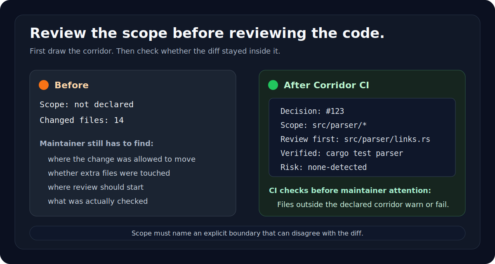

# Corridor CI

**First-glance PR triage before deep review.**

Corridor CI is a small GitHub Action for maintainers who need a quick answer
before spending review attention: is this PR ready for a close look, and where
should that look start?

Why this exists: [The Corridor Manifesto](docs/MANIFESTO.md).

It asks non-trivial PRs for a compact handoff:

```md
Decision: #123
Scope: pkg/parser/*, tests/parser/*
Review first: pkg/parser/links.py
Verified: pytest tests/parser
Risk: none-detected
```

`Decision` points to where the why already lives: an issue, discussion, RFC,
spec, bug reproduction, maintainer request, or a clearly small fix.

`Scope` is the declared review boundary. With explicit paths or globs, Corridor
CI compares the actual diff against the stated boundary and reports when the PR
touched more than it said it would.

`Scope` must contain explicit paths or globs. Mirroring the changed files back
as the declared boundary does not constrain anything, so `auto` is rejected.

It is not an AI detector, a spam score, an AI reviewer, or a code quality check.
Humans still review the code. A red check means information is missing or the
declared boundary does not match the diff; it does not mean the code is bad.

For agent-authored PRs, the value is a shaping signal: say why the change
exists, declare where it was meant to stop, and point the maintainer at the
first file to read.



## Quick Start

```yaml
name: Corridor CI

on:
  pull_request:
    types: [opened, edited, synchronize, reopened]

jobs:
  corridor:
    runs-on: ubuntu-latest
    steps:
      - uses: actions/checkout@v4
        with:
          fetch-depth: 0

      - uses: shihchengwei-lab/coding-agent-guardrails/corridor-ci@corridor-ci-v13.0.0
        with:
          mode: fail
```

The default is `mode: fail`. Use `warn` only for a deliberate observation-only
trial; it is not a guardrail until issues return a non-zero result.

Add this to the PR body:

```md
Decision: #123
Scope: pkg/parser/*, tests/parser/*
Review first: pkg/parser/links.py
Verified: pytest tests/parser
Risk: none-detected
```

The cheapest adoption path is to copy
[`examples/PULL_REQUEST_TEMPLATE.md`](examples/PULL_REQUEST_TEMPLATE.md) to
`.github/PULL_REQUEST_TEMPLATE.md`.

The standalone format spec is in
[`docs/HANDOFF_SPEC.md`](docs/HANDOFF_SPEC.md).

## Handoff Notes

`Decision` can be an issue, discussion, RFC, spec, bug reproduction, maintainer
request, URL, or small self-contained fix.

Use explicit paths or globs when you want the PR to stay inside a declared
corridor:

```md
Scope: pkg/parser/*, tests/parser/*
```

`Scope: auto` and match-everything patterns are rejected because they restate
the diff instead of declaring where the change was meant to stop.

`Review first` must be one of the changed files.

`Verified` may describe a manual check. When a committed agentcam manifest is
available, Corridor CI labels the line `local-recorded` only when its exact
grammar, integer exit-0 result, verification state fingerprint, and product
fingerprint match the current PR and the handoff uses
`[locally recorded by agentcam]`. The old marker is rejected. Otherwise it reports `manual` or
`unverified`; hook-mode or legacy capture is also marked `partial`. Manual
verification remains valid and visibly weaker. A placeholder or false recorded
claim is `unverified` and fails the corridor.

Glob matching uses git-style semantics. `*` and `?` never cross `/`, so
`pkg/*` matches `pkg/a.py` but not `pkg/sub/deep.py`. `**/` spans zero or
more directories, so `pkg/**/*.py` covers both `pkg/top.py` and
`pkg/sub/deep.py`. `dir/**` means the directory and the whole subtree.

## What It Checks

- Required handoff fields exist.
- Explicit `Scope` paths or globs cover the changed files.
- `Review first` points to a changed file.
- Dependency manifest changes require an OWNER/MEMBER comment bound to the
  current head SHA: `Guardrails-Dependency-Approval: <full-head-sha>`.
- `Risk` must be `high`, `medium`, `none-detected`, or `unknown` and cannot
  underreport the committed agentcam manifest.
- `Verified` names a completed manual check or matches a passing agentcam check.

Warnings never block. Corridor CI warns when `Decision` has no
issue/discussion/URL reference, when verification is manual, when capture is
partial, or when the PR body is too long to keep the compact handoff easy to
find. A scope that carries no information is an issue, not a warning.

If the handoff is missing or incomplete, the CI summary includes a copyable blank
handoff.

Every run writes a GitHub step summary for maintainers.

Installing this workflow does not make it a merge gate. Add `Corridor` and the
repository's test jobs as required checks in branch protection or a GitHub
ruleset; use strict/up-to-date checks when the base branch must be current.

## Sticky PR Comment

Set `comment: true` to upsert the same report as a sticky PR comment.

```yaml
permissions:
  contents: read
  pull-requests: write

steps:
  - uses: shihchengwei-lab/coding-agent-guardrails/corridor-ci@corridor-ci-v13.0.0
    with:
      comment: true
```

Fork PRs can receive a read-only `GITHUB_TOKEN`, which may make the comment API
return `403`. Corridor CI logs one line and continues; the step summary is still
written.

## Inputs

| input | default | meaning |
|---|---:|---|
| `mode` | `fail` | `fail` exits non-zero on issues; `warn` only reports. |
| `comment` | `false` | Upsert the report as a sticky PR comment. |
| `agentcam_evidence` | `.agentcam/manifest.redacted.json` | Committed agentcam manifest (from `agentcam export --files`); its evidence, verification provenance, and capture coverage are appended. Unverified claims fail; manual and partial provenance remain visible. |

## Philosophy

Corridor CI is a receiving-side triage aid. It helps maintainers decide whether
a PR has enough review context and gives authors a small structure for handing
work over.

The rule is simple:

> If a PR wants review, it should say why it exists, where it meant to move, and
> where the reviewer should start.

## License

MIT
