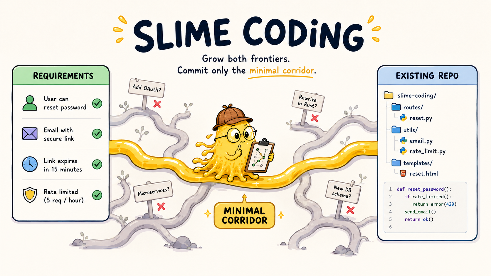

# Slime Coding

[](https://github.com/shihchengwei-lab/coding-agent-guardrails/actions/workflows/slime-coding.yml)

**Slime Coding — 讓最聰明的 AI，跟最沒腦的黏菌學會克制。**



每天用 AI 寫 code 的人都知道：現在的問題通常不是 AI 做不出來，而是它太容易把任務往外延伸。

它會加一層你沒要求的抽象、碰幾個本來不用碰的檔案、引入新套件、改掉既有資料流，甚至引用一個 repo 裡根本不存在的函數。功能最後也許能跑，但 diff 會多出一堆你沒有打算維護的東西。

Slime Coding 管的是這件事：**最小充分語義位移**。

不是最小 diff，也不是最少行數。它在意的是：完整滿足可觀察目標，同時不順手移動既有架構、命名、API、資料流和責任邊界；不能拿較少 LOC 換隱藏狀態或更高理解成本。

## 它做什麼？

Slime Coding 不是再寫一段「請不要過度實作」給 AI 看。那種文字只是提醒，AI 忙起來會忘。

它把幾個容易失控的點接成自動關卡：

- **動手前先框範圍**：AI 要先寫出可觀察結果與允許路徑；Edit／Write／apply_patch 會在寫入前檢查，Bash 寫入則在工具完成後立即比對並要求復原。
- **全 repo 與 repo 外都不是走廊**：match-all Paths 和 `../`／絕對路徑會被拒絕。
- **先找反證再押路線**：normal／high 走廊除了支持證據，也要寫出什麼觀察會證明這條路錯了。
- **負擔隨風險調整**：trivial 只留 Outcome／Paths／Stop Condition；normal 加支持與反證；high 再加入 failure mode、rollback 與 secondary trusted check ID。
- **只算本輪改動**：SessionStart／UserPromptSubmit 在 `.git/slime/turns/` 保存 turn baseline；既有髒檔未變不歸給 agent，修改、stage、commit、rename、delete 或還原才算本輪 delta。
- **範圍外的修改會被擋**：如果 AI 順手改了不在範圍內的程式碼，收工時會被擋下來。
- **新增套件會被擋**：Flutter、npm、Python、Cargo、Go 的新增套件要在 Evidence 具名並說明理由，否則不能收工。
- **引用不存在的接點會被擋**：可選。你可以接型別檢查或語法檢查，讓 AI 不能靠想像中的 helper / class / API 收工。
- **紅燈不能假裝完成**：Stop Condition 的 `Check:` 只從 `<git-dir>/guardrails/config.json` 取得 argv，並以 `shell=False` 重跑；high 的 `Independent check:` ID 與 argv 都必須不同於主檢查。紅燈、timeout、未知 ID 或壞設定都持續阻擋。repo Markdown 與舊 command 環境變數不會被當成 shell 執行，PRUNED 也不能當 waiver。

簡單說就是：

> 多想一點，少偏離一點。

## 什麼時候有用？

適合：

- 你已經每天用 Claude Code / Codex / 其他 AI coding 工具改 repo。
- 你的 repo 已經有架構、命名、helper、測試和約定。
- 你在意 AI 不要把一個小需求擴成一串旁支。
- 你常遇到「功能有做完，但 diff 看起來很不對」。

不太適合：

- 一次性試作品。
- 你就是想讓 AI 大幅重構。
- 專案沒有測試、沒有型別檢查，也不在意檔案邊界。

## 怎麼用？

每個要套 Slime Coding 的專案，各跑一次。Claude Code 用（根安裝器會把
整套工具包一起裝好，Slime hooks 是其中一步）：

```bash
git clone <這個 repo> ~/guardrails
cd /你的專案
~/guardrails/install.sh .
```

只想接 hooks 也可以單獨跑 `~/guardrails/slime-coding/install.sh .`；
紀律區塊一律由根安裝器寫入。

Codex on Windows 用：

```powershell
git clone <這個 repo> $HOME\guardrails
cd \你的專案
powershell -ExecutionPolicy Bypass -File $HOME\guardrails\slime-coding\install-codex.ps1 -Project .
```

Claude 安裝會做幾件事：

- 把 Claude 的自動關卡接進 `.claude/settings.json`。
- 裝 `/slime-corridor` 和 `/slime-prune` 指令。
- 建立 `.slime/corridor.md` 和 `.slime/PRUNED.md` 範本。

Codex 安裝會做幾件事：

- 把自動關卡接進 `.codex/hooks.json`。
- 把 `slime-navigate` skill 複製到 `.agents/skills/slime-navigate`。
- 建立 `.slime/corridor.md` 和 `.slime/PRUNED.md` 範本。

需要 `python3` 和 `git`（解析 `pyproject.toml`／`Cargo.toml` 需要 Python 3.11+ 的 `tomllib`）。新安裝的 corridor 預設為 `normal`。安裝可以重跑，不會備份既有設定，也不會覆蓋已存在的 corridor；失敗時只用 transaction journal 還原本次變動。`AGENTS.md` 的紀律區塊只由根安裝器管理，standalone Slime installer 不會改它。

可執行檢查放在 Git 外的 `<git-dir>/guardrails/config.json`，例如：

```json
{
  "schema": 1,
  "checks": {
    "primary": {
      "argv": ["python", "-m", "pytest", "-q"],
      "timeout_seconds": 600
    }
  }
}
```

Corridor 只寫 `- Check: primary`。check ID 限小寫英數、`-`、`_`，長度 1–64；
`argv` 必須是非空字串陣列，timeout 合法範圍是 1–3600 秒。舊的 inline
舊的 inline command 與 command 環境變數完全不參與 runtime；請依[遷移指南](../docs/MIGRATION.md)改用 trusted check ID。

紀律文本（含本套規則的用法）由根安裝器寫進 `CLAUDE.md` 與 `AGENTS.md`，單一來源是根目錄的 [`templates/DISCIPLINE.md`](../templates/DISCIPLINE.md)，不需要手動貼模板。
Codex 版一樣自動更新 `AGENTS.md`；下次啟動 Codex 或開新 run 後生效。若 Codex 提示 project hooks 尚未 trust，進 `/hooks` 檢查後信任。

## Benchmark 怎麼看？

這不是「AI coding 已被解決」的證明，只是一個時間點快照：在同一批任務上，裝 Slime Coding 之後，AI 有沒有更少漂移。

2026-06-29，用 Ponytail-derived task pool 跑 Claude Haiku：

- 19 題
- `baseline` / `ponytail` / `slime-coding` 三組
- 每題每組 4 次
- 共 228 個有效樣本
- 429 額度失敗與跑太久中斷的樣本已重跑
- `slime-coding` 使用當時的 strict corridor 版本（commit `291c309`）：
  範圍外程式碼修改會被擋

| 組別 | 通過率 | touched files | 總 LOC | vs baseline LOC | 平均 cost | 平均 tokens | 平均時間 |
|---|---:|---:|---:|---:|---:|---:|---:|
| baseline | 69/76 = 90.8% | 115 | 5744 | baseline | $0.0897 | 331k | 49.8s |
| ponytail | 72/76 = 94.7% | 147 | 5055 | -12.0% | $0.1047 | 299k | 55.6s |
| slime-coding | 76/76 = 100.0% | 107 | 4351 | -24.3% | $0.1223 | 478k | 76.6s |

同一批 19 題再用 Codex CLI / `gpt-5.4-mini` 跑 baseline 與 Slime Coding，當成跨廠商 sanity check：

- 2026-07-01
- `baseline` / `slime-coding` 兩組
- 每題每組 4 次
- 共 152 個 clean cells
- Codex CLI 不回報 per-run cost，所以這張表不列 cost

| 組別 | 通過率 | touched files | 總 LOC | vs baseline LOC | 平均 tokens | 平均時間 |
|---|---:|---:|---:|---:|---:|---:|
| baseline | 76/76 = 100.0% | 122 | 7196 | baseline | 232k | 130.9s |
| slime-coding | 76/76 = 100.0% | 104 | 5543 | -23.0% | 262k | 158.0s |

直覺讀法：

- Claude Haiku 那輪，Slime Coding 通過率最高，也碰最少檔案、產生最少 LOC。
- Codex / `gpt-5.4-mini` 那輪，baseline 已經 100% 通過；Slime Coding 沒提高通過率，但仍少碰 14.8% 檔案、少寫 23.0% LOC。
- 代價是 token、時間、cost 或 CLI runtime 通常更高。

所以它不是省錢工具，也不是加速工具。它比較像一個保守的防護欄：多花一點思考成本，換比較小的改動面。

完整資料在 [`benchmark/`](benchmark/)。

## 限制

- 它不是 filesystem sandbox。direct edit 是寫前阻擋；shell 是寫後偵測，副作用已發生，hook 不能復原。真正的硬邊界仍是 OS 權限／sandbox；CI、測試與人工 review 負責後續 gate。Codex hooks 本身也是 guardrail，不是完整 enforcement（[Codex Hooks](https://learn.chatgpt.com/docs/hooks)）。
- 它不能判斷所有設計好壞，只擋明確事實：格式不完整、範圍外檔案、未說明的新套件、紅燈收工與已設定的型別檢查失敗。`trivial` 限一個 product file；normal/high 的選擇仍由作者負責。
- 沒有測試或型別檢查的 repo，效果會打折。
- 它會增加流程成本。benchmark 也顯示它更耗 token、時間和錢。

如果你要的是「便宜、快、能跑就好」，這不是它的方向。

如果你要的是「AI 可以寫，但不要把每個小需求都擴成一輪大改動」，這就是它想解的問題。

## 更多細節

- 概念說明：[`docs/CONCEPT.md`](docs/CONCEPT.md)
- 機制設計：[`docs/DESIGN.md`](docs/DESIGN.md)
- benchmark 原始資料：[`benchmark/`](benchmark/)
- 變更紀錄：[`CHANGELOG.md`](CHANGELOG.md)

## License

MIT — 見根目錄 [`LICENSE`](../LICENSE)。
